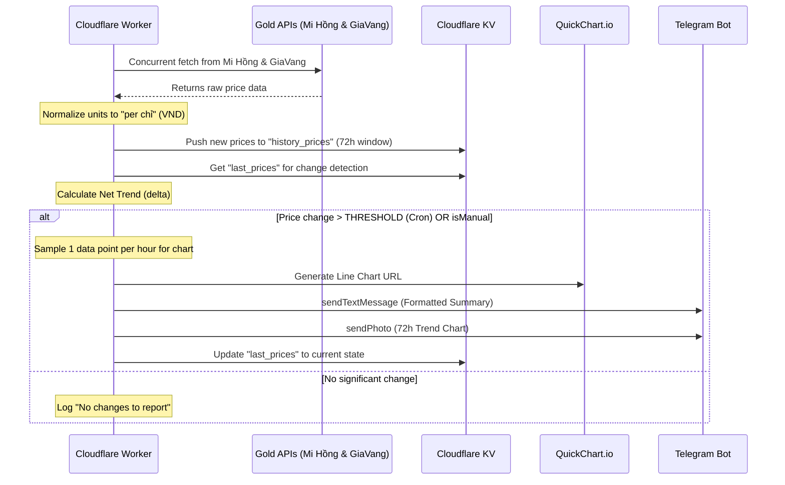

# System Architecture

This document describes the internal workings and data flow of the **Vietnam Gold Prices Telegram Bot**.

## System Components

The bot is entirely serverless, built on the Cloudflare Developer Platform:

-   **Cloudflare Workers**: The core TypeScript engine. Orchestrates fetching, data normalization, and Telegram communication.
-   **Cloudflare KV (Key-Value storage)**: 
    -   `last_prices`: Stores the previous selling price for each gold variant to detect movement.
    -   `history_prices`: Stores a sliding window (default 3 days) of `{price, timestamp}` entry arrays for charting.
-   **QuickChart.io**: An external API used to generate high-quality Line Charts as images for market visualization.
-   **Cloudflare Secrets**: Securely stores the Telegram `TOKEN` and `CHAT_ID`.

## Data Flow

The following sequence diagram illustrates how a typical monitoring cycle (Cron) works with multiple data sources:

## Internal Logic

### 1. Smart Thresholding
To prevent cluttering the chat with noise, the bot only sends automated alerts when the price of a gold variant moves by more than the `THRESHOLD` (defined in environment variables, default: **50,000 VND**).

### 2. Selective Alerts vs Full Reports
-   **CRON (Automated)**: Only includes gold variants in the text summary if they have actually moved.
-   **WEB (Manual)**: Provides a comprehensive full summary of all tracked prices, regardless of change.
-   **Chart**: The chart **always** displays the full history for all 4 gold variants to maintain market context.

### 3. Data Normalization
The bot ensures all data is comparable by standardizing to **"per chỉ"** (1/10th of a "lượng"). This includes dividing GiaVang's prices by 10 internally.

### 4. Visual Optimization (Hourly Sampling)
To keep charts clean and professional, the system uses a **sampling algorithm** that picks exactly one data point per hour from the 72-hour history. This prevents the chart from becoming overcrowded with hundreds of points.

---
*Last Updated: March 24, 2026*
